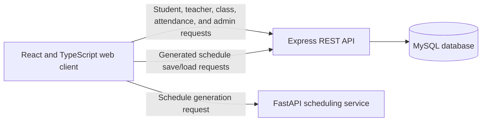

# STEP School Management System
## Developer Guide

**Document type:** Academic software engineering guide  
**Project:** STEP School Management System  
**Document version:** 1.0  
**Prepared:** 25 September 2026

## Abstract

The STEP School Management System is a web-based application for managing selected academic and administrative activities in a school. Its current implementation consists of a React and TypeScript frontend, a Node.js and Express API backed by MySQL, and a Python scheduling service that uses Google OR-Tools. The system provides role-oriented interfaces and workflows for student records, attendance, marks, class placement, timetables, leave requests, announcements, and account management. This guide describes the implemented architecture, repository organization, local development procedure, principal data flows, and practices for maintaining and evaluating the software. It also records implementation constraints that developers should understand before modifying or deploying the system.

## 1. Purpose and Scope

This document is intended for developers who need to install, run, inspect, test, or extend the STEP School Management System. It describes the repository as implemented rather than treating all proposed capabilities as completed functionality. It is not a user manual, a database administration manual, or a substitute for institutional deployment approval.

The system's stated scope includes academic records, attendance, grading, class placement, timetable generation, teacher relief allocation, leave requests, announcements, and user accounts. Financial processing and integration with national examination boards are outside the stated project scope.

## 2. System Overview

The application uses a multi-service client-server design:



The frontend is a single-page application bootstrapped in `src/main.tsx`. It uses React Router and feature components under `src/app/components/`. Most API requests use the base URL exported from `src/apiConfig.js`. Timetable generation uses a second base URL exported from `src/config.js` and posts to the Python service. The Express service in `student-server/server.js` handles the main REST API and database operations. It creates the MySQL tables described in its startup schema and listens on port `8081` by default. The Python service in `student-server/server.py` exposes the schedule-generation endpoint and defaults to port `8000`.

> **Configuration note:** Both frontend API base URLs are currently hard-coded and point to different hosted services. Before local development or deployment, confirm which service each value is intended to reach and update the appropriate configuration. The Python scheduler and Express API are separate services; changing one base URL does not redirect requests sent to the other.

## 3. Technology Stack

| Layer | Technologies | Responsibility |
| --- | --- | --- |
| Web client | React, TypeScript, Vite, React Router | User interfaces, navigation, and API requests |
| UI and styling | Tailwind CSS, custom CSS, Radix-based UI components, Lucide icons | Shared presentation and interactive controls |
| Main API | Node.js, Express, `mysql2` | REST endpoints, validation, business operations, database access |
| Persistence | MySQL | Accounts, student and teacher records, classes, attendance, marks, leave, and schedules |
| Schedule generation | Python, FastAPI, Pydantic, Google OR-Tools CP-SAT | Constraint-based timetable generation |
| Email | Nodemailer | Leave status email notifications |

The root `package.json` provides the frontend development and production-build scripts. The `student-server/package.json` provides the Express startup script. Python dependencies are listed in `student-server/requirements.txt`.

## 4. Repository Organization

| Path | Contents |
| --- | --- |
| `src/main.tsx` | Frontend entry point and router setup |
| `src/app/App.tsx` | Application-level composition and navigation flow |
| `src/app/components/` | Feature screens, including dashboards, class management, marks, leave, and timetables |
| `src/app/components/ui/` | Reusable interface primitives |
| `src/styles/` | Global styles, theme, and font definitions |
| `src/apiConfig.js` | Base URL for most Express API calls |
| `src/config.js` | Base URL used by selected features, including the Python schedule generator |
| `student-server/server.js` | Express API, MySQL schema initialization, and route handlers |
| `student-server/server.py` | FastAPI endpoint and OR-Tools timetable model |
| `student-server/requirements.txt` | Python service dependencies |
| `docs/` | Project documentation and supporting assets |
| `guidelines/` | Project guidelines |

## 5. Main Functional Modules

- **Authentication and accounts:** The login screen submits credentials to the API. Account management creates user records and, for teacher and student roles, associated profile records.
- **Student management and placement:** Student records can be listed and managed, and student placement assigns students to classes.
- **Class and homeroom management:** Class records associate a room and an optional homeroom teacher. Homeroom workflows expose student lists and attendance operations.
- **Attendance:** Attendance can be recorded per student and date, including bulk marking. The database enforces one attendance record per student per date.
- **Marks and progress:** The marks endpoint checks the homeroom teacher assignment before saving marks. It also calculates a GPA value and generates focus-area records from scores.
- **Timetable management:** The Python service generates a schedule using teacher, room, section, weekly-period, and workload constraints. The frontend can then send generated schedules to the Express API for persistence.
- **Leave and relief:** Teachers submit leave requests. Principal workflows review requests and relief allocation suggests available teachers based on schedule availability and subject specialty.
- **Announcements and dashboards:** Announcement endpoints and dashboard queries supply data to the relevant role-oriented screens.

## 6. Data and API Design

The Express service initializes core tables using `CREATE TABLE IF NOT EXISTS` statements. The principal entities include `users`, `students`, `teachers`, `classes`, `attendance`, `curriculum_subjects`, `leave_requests`, `timetables`, `student_gpa_history`, `announcements`, and `activity_logs`. Additional tables are referenced by some application workflows and must exist in the target database for those workflows to function.

API routes are defined directly in `student-server/server.js`. The implementation uses JSON request and response bodies and parameterized SQL values for many database operations. Representative route groups include:

| Route group | Purpose |
| --- | --- |
| `/login`, `/users` | Login and user account operations |
| `/students`, `/student-dashboard/:id` | Student records and dashboard data |
| `/classes`, `/classes/with-students`, `/homeroom/:classId` | Class, placement, and homeroom data |
| `/attendance` and `/attendance/mark-all` | Attendance entry |
| `/api/student-marks`, `/api/homeroom/:teacher_id/students` | Mark entry and homeroom student data |
| `/schedules`, `/timetable/:classId` | Persisted schedule retrieval and saving |
| `/allocate-relief`, `/confirm-relief`, `/leave-request` | Leave and relief workflows |
| `/api/announcements`, `/principal/dashboard` | Announcements and principal dashboard data |
| Python `POST /generate-schedule` | Timetable generation request and response |

Route behavior is not uniformly REST-normalized; follow established route names and payload shapes when changing the frontend/API contract. Validate both sides of a changed contract.

## 7. Development Environment

### 7.1 Prerequisites

Install the following software before starting development:

- Node.js and npm compatible with the versions of Vite and the server dependencies declared in the package manifests.
- Python 3.10 or later for the type syntax used in `server.py`.
- A running MySQL server and a database created for development.
- Git and a code editor such as Visual Studio Code.

### 7.2 Install dependencies

From the repository root, install frontend dependencies:

```powershell
npm install
```

Install the Express service dependencies:

```powershell
Set-Location student-server
npm install
```

Install Python scheduler dependencies in a virtual environment:

```powershell
python -m venv .venv
.\.venv\Scripts\Activate.ps1
python -m pip install -r requirements.txt
```

On systems using a different shell, activate the virtual environment using that shell's standard activation command.

### 7.3 Configure the database

The Express service reads its database connection from process environment variables. Set these variables in the terminal or hosting environment before starting the service:

| Variable | Description |
| --- | --- |
| `DB_HOST` | MySQL host name |
| `DB_USER` | MySQL user |
| `DB_PASSWORD` | MySQL password |
| `DB_NAME` | Database/schema name |
| `DB_PORT` | MySQL port; defaults to `3306` |
| `PORT` | Express listening port; defaults to `8081` |

For a PowerShell terminal, set values for the current session with commands of the following form. Use local development credentials and do not commit real credentials:

```powershell
$env:DB_HOST = "localhost"
$env:DB_USER = "your_local_user"
$env:DB_PASSWORD = "your_local_password"
$env:DB_NAME = "step_development"
$env:DB_PORT = "3306"
```

The server creates its declared tables when a database connection is available. It does not load a `.env` file in the current implementation, so defining variables in such a file alone will not configure the process unless a loader is added or the hosting platform injects the values.

### 7.4 Configure frontend service URLs

Before local testing, review `src/apiConfig.js` and `src/config.js`. Set the first to the reachable Express API origin and the second to the reachable FastAPI scheduler origin. The API services must be started separately. Configure corresponding CORS allowlists for the actual frontend origin before deploying; do not use permissive development CORS settings for a production deployment.

### 7.5 Start the services

Start the Express API in one terminal after configuring the database variables:

```powershell
Set-Location student-server
npm start
```

Start the timetable service in another terminal, with the Python virtual environment activated:

```powershell
Set-Location student-server
python server.py
```

Start the frontend from the repository root in a third terminal:

```powershell
Set-Location <repository-root>
npm run dev
```

Vite prints the local development URL in the terminal, normally `http://localhost:5173`. Open that URL after confirming both backend service origins are configured correctly.

For a production frontend bundle, run from the repository root:

```powershell
npm run build
```

The production frontend output is written to `dist/`. Deployment and hosting configuration are environment-specific and are not automated by the scripts currently present in the repository.

## 8. Development and Maintenance Workflow

1. Identify the feature component and the corresponding API route before changing behavior.
2. Keep request and response fields consistent across the frontend and backend. When changing a contract, update both sides together.
3. Use the existing UI primitives and styling conventions in `src/app/components/ui/` and `src/styles/` where applicable.
4. Keep database access parameterized, validate incoming request data, and return appropriate HTTP status codes.
5. For schema changes, update the startup schema and consider how an existing database will be migrated. `CREATE TABLE IF NOT EXISTS` does not alter an already-created table.
6. Run the frontend production build after frontend changes. Exercise relevant API workflows against a development database after backend or schema changes.
7. Do not include real student data, passwords, API secrets, or mail credentials in source control, documentation, screenshots, or test fixtures.

## 9. Testing and Quality Assurance

The current package manifests define development, startup, and build scripts but do not define automated test scripts. The documentation therefore does not claim a verified automated unit- or end-to-end-test suite. For changes, use focused manual verification until automated coverage is established:

- Build the frontend with `npm run build` to detect compile and bundling errors.
- Verify API status codes and response bodies for the changed endpoint using a local database or an API client.
- Exercise the related user workflow in the browser, including validation and error responses.
- For schedule generation, submit representative feasible and infeasible inputs and confirm both the solver response and schedule persistence behavior.
- Check that database writes preserve relationships and rollback correctly where transactions are used.

A future quality-assurance improvement is to add repeatable frontend component tests, API integration tests using an isolated database, and schedule constraint tests.

## 10. Security, Privacy, and Deployment Considerations

The application handles student and staff information, so deployments require appropriate institutional approval and data-protection controls. The following points describe the current implementation and should be considered before production use:

- The login endpoint compares submitted passwords with bcrypt hashes. However, the Express API does not currently apply a general authentication or authorization middleware to all routes. A role-aware frontend alone is not a security boundary; server-side authorization should be implemented and tested before production use.
- Database and email credentials must be supplied through protected environment configuration. Any credential previously committed or shared should be rotated and removed from the source history as appropriate.
- The frontend service URLs are hard-coded, and the Express CORS configuration names a hosted frontend origin. Make environment-specific configuration explicit and verify CORS settings for each deployment.
- The Python service currently allows broad cross-origin access. Restrict origins, methods, and headers to the deployed frontend as part of production hardening.
- Avoid returning raw database error objects to clients. Log diagnostic details on the server and return non-sensitive error messages to users.
- Validate authorization for destructive actions, account administration, marks, leave decisions, and access to student records at the API layer.
- Use HTTPS, least-privilege database accounts, backups, data-retention policies, and sanitized development data.

## 11. Known Implementation Constraints

The following observations are relevant to developers and should be rechecked as the project evolves:

- Two API base URL constants are used by different frontend modules; timetable generation is sent to a distinct scheduling service.
- Some dashboard responses contain demonstration or randomized values. Such values should not be interpreted as authoritative school data.
- Server-side database initialization creates only the schemas declared in `server.js`; some endpoints reference additional tables. Feature readiness depends on the deployed database schema.
- Schema declarations are not a versioned migration system. Changes to existing tables need an explicit migration strategy.
- The project has no test command in the package manifests at the time this guide was prepared.

## 12. Troubleshooting

| Symptom | Checks |
| --- | --- |
| Frontend loads but data requests fail | Confirm the frontend API base URL, backend process, CORS origin, and browser network response. |
| Express reports a database connection failure | Confirm `DB_HOST`, `DB_USER`, `DB_PASSWORD`, `DB_NAME`, and network access to MySQL. |
| Schedule generation cannot connect | Confirm the scheduler is running and `src/config.js` points to its origin. |
| Scheduler returns a failed status | Inspect the response message; check teacher specialty matches, weekly periods, teacher workload, room availability, and section constraints. |
| A feature reports a missing-table error | Compare its SQL query with the table schemas initialized in `student-server/server.js` and the actual database. |
| Browser requests are blocked | Verify each service's CORS configuration and the requesting frontend origin. |
| Existing table structure does not match code | `CREATE TABLE IF NOT EXISTS` does not update existing tables; apply a reviewed migration. |

## 13. Conclusion

The STEP School Management System brings several school workflows into a shared web application supported by a relational database and a separate constraint-based scheduler. Effective maintenance depends on understanding the boundaries between these services, preserving frontend/API contracts, and validating changes against a development database. Before production deployment, priority should be given to server-side authorization, environment-based service configuration, database migrations, privacy controls, and automated testing.

## Glossary

| Term | Definition |
| --- | --- |
| API | Application Programming Interface used by the frontend to communicate with backend services |
| CORS | Cross-Origin Resource Sharing, a browser security mechanism controlled by server response headers |
| CP-SAT | Constraint Programming - Satisfiability solver provided by Google OR-Tools |
| GPA | Grade Point Average |
| REST | Resource-oriented style for HTTP API design |
| RBAC | Role-Based Access Control |
| Vite | Frontend development server and build tool used by the project |
